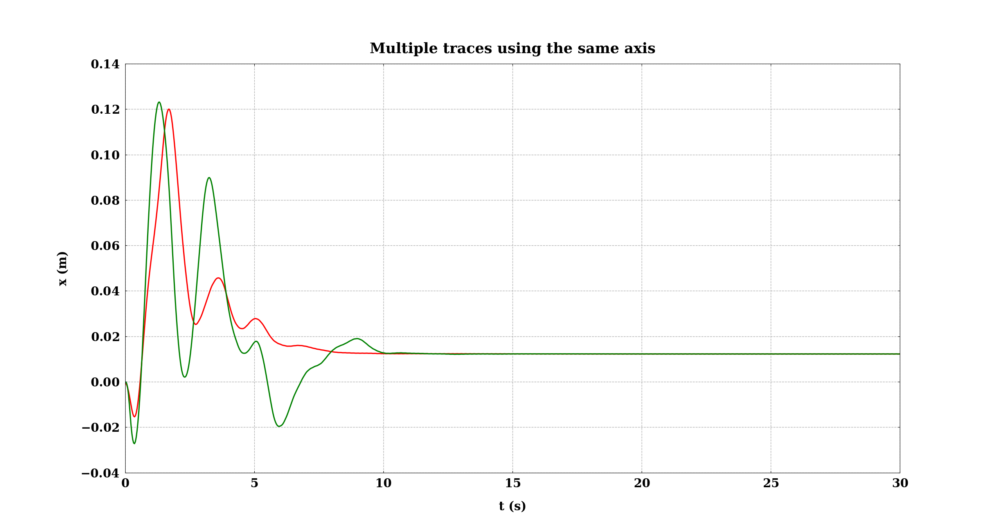

# HOW TO USE `plots.py`

`plots.py` can be used to plot one or multiple traces using the same axis or multiple axes into the same figure, in both
2D and 3D.

## The _matplotlibrc_ file

## How to plot one single trace or multiple traces into the same axis

The `single_axis_2D` function allows you to plot one or multiple 2D traces, all in the same axis.

### Example:
`single_axis_2D` takes as arguments: 
- **files:** a list with the name of at least one _csv_ file that should contain two columns, the 
first one with the x data and the second one with the y data. 
- **references:** whether you need add to the plot reference guides as comparison, the `references` argument is a dictionary containing to keys:
  - `view` (`True` or `False`) to show or no the reference guides.
  - `files` a list of _csv_ files with the coordinates (two columns) of the references guides.
- **colors:** a dictionary with two keys: 
  - `color_mode` (`custom` or `auto`). Whether `color_mode` is set to 'custom', the color assignation will the use the color list 
    contained in the _matplotlibrc_ file (see `axes.prop_cycle` in _matplotlib.rc_ file) and `color_list` could be avoided. Find a list of color names in [Matplotlib color names][1].
  - `color_list`, a list with the colors that will be used to pain the traces. Colors can be specified using 
    names ('red', 'green', 'blue', etc.), a hexadecimal string ('1f77b4') or four components tuple (RGBa) with values 
    between 0 and one. 
- **settings:** a dictionary with two keys:
  - `limits` a dictionary with keys: `mode` (`custom` or `auto`). Whether you use `auto`, the length of each axis will be set using max and min values, with `custom` should be added the keys `x_range` and `y_range`, each one with a tuple specifying the length of the correspondent axis.
  - `labels` a dictionary with three keys: `x_label`, `y_label`, `title` each one with a string as a value. 

```python
single_axis_2D(
        files=[
            'save-flight-starting-from-x0y1z0-03.19.2024_15.26.29/x0.csv',
            'save-flight-starting-from-x0y1z2-03.19.2024_15.52.13/x0.csv'
        ],
        references=dict(view=False),
        colors=dict(
            color_mode='custom',
            color_list=['red', 'green']
        ),
        settings=dict(
            limits=dict(mode='auto'),
            labels=dict(
                x_label='t (s)',
                y_label='x (m)',
                title='Multiple traces using the same axis'
            )
        )
    )
```



**NOTE:** you can add more stylish themes combining `plots.py` with [aquarel][2]. All that you need to do is to import `aquarel` and put the definition of the theme at the beginning of the `init` function to be apply to all the plots.

[1]: https://matplotlib.org/stable/gallery/color/named_colors.html
[2]: https://github.com/lgienapp/aquarel?tab=readme-ov-file